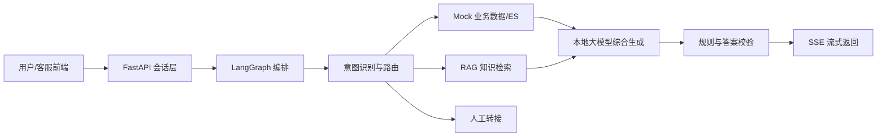

# 汽车后市场智能客服 Demo

面向汽车后市场轮胎业务线的本地智能客服原型。项目使用 FastAPI 提供会话与 Mock 业务接口，使用 LangGraph 编排意图识别、业务查询、RAG 检索、答案生成、结果校验和人工转接，并通过 Ollama 在本地运行 Qwen 模型。

当前版本用于验证整体技术路线和交互流程，不是可直接上线的生产系统。

## 核心能力

- 轮胎规格、保养和安全知识问答
- 客户、车辆、商品、价格、活动和订单 Mock 查询
- Mock Elasticsearch `_search` 接口
- 本地知识库检索，预留 Milvus Repository 替换边界
- LangGraph 多节点路由和结果校验
- 高风险及退款意图转人工
- SSE 流式状态、答案、引用和完成事件
- 本机及同一局域网访问
- Ollama 不可用时的可测试 Mock 模式

## 技术栈

- Python 3.11
- FastAPI
- LangGraph
- Ollama
- `qwen3:1.7b-q4_K_M` 对话模型
- `qwen3-embedding:0.6b` 向量模型
- JSON Mock 数据及本地向量文件
- Milvus 生产替换接口边界

## 工作流程



## 仓库结构

```text
.
├─ local-demo/                 # 可运行的本地 Demo
│  ├─ app/                    # API、LangGraph、模型及页面代码
│  ├─ data/                   # Mock 业务数据和知识向量
│  ├─ scripts/                # 启停、向量生成、压测和冒烟测试
│  └─ tests/                  # 自动化测试
├─ 智能客服_本地轻量Demo方案.md
└─ 智能客服_轮胎业务线_需求调研与总体设计方案.md
```

模型、Python 运行时、虚拟环境和运行日志不会提交到 Git 仓库。

## 环境要求

- Windows 10/11 64 位
- 推荐至少 16GB 内存
- CPU 模式可以运行，首次完整问答通常需要数十秒
- 建议为模型和 Ollama 预留至少 5GB 磁盘空间
- 本项目当前使用纯英文运行目录，避免 Windows 中文路径兼容问题：

```text
C:\AI\ollama
C:\AI\models
```

## 安装依赖

进入 Demo 目录，安装 uv 并同步锁定依赖：

```powershell
cd local-demo
python -m pip install uv
python -m uv sync --dev
```

安装 Ollama 后，将模型保存到 `C:\AI\models`，然后执行：

```powershell
.\install-ollama-models.ps1
```

生成本地知识向量：

```powershell
.\.venv\Scripts\python.exe scripts\ingest_embeddings.py
```

## 启动与停止

一键启动 Ollama 和客服服务：

```powershell
cd local-demo
.\start-all.cmd
```

访问地址：

- 本机：`http://127.0.0.1:8000`
- 局域网：`http://<本机IPv4>:8000`

停止服务：

```powershell
.\stop-all.cmd
```

## 局域网访问

服务默认监听 `0.0.0.0:8000`。如需让同一 Wi-Fi 下的其他设备访问，请使用管理员 PowerShell 添加仅适用于专用网络的防火墙规则：

```powershell
New-NetFirewallRule `
  -DisplayName "Tire Customer Service Demo LAN" `
  -Direction Inbound `
  -Action Allow `
  -Protocol TCP `
  -LocalPort 8000 `
  -Profile Private
```

运行 `ipconfig` 查看本机 IPv4 地址。局域网 IP 可能在重新联网后变化。

## 主要 API

| 方法 | 路径 | 说明 |
|---|---|---|
| GET | `/api/v1/health` | 服务、模型和数据状态 |
| POST | `/api/v1/conversations` | 创建客服会话 |
| POST | `/api/v1/conversations/{id}/messages` | 普通问答 |
| POST | `/api/v1/conversations/{id}/messages/stream` | SSE 流式问答 |
| GET | `/mock/customers/{id}` | Mock 客户查询 |
| POST | `/mock/search/products` | Mock 轮胎商品查询 |
| POST | `/mock/orders/query` | Mock 订单查询 |
| POST | `/mock-es/{index}/_search` | Mock ES 查询 |

流式接口主要事件：

```text
message.accepted
tool.status
answer.delta
citation
answer.completed
answer.error
```

## 测试

使用 Mock 模式运行确定性自动化测试：

```powershell
cd local-demo
$env:LLM_MODE = 'mock'
.\.venv\Scripts\python.exe -m pytest -q
```

流式接口冒烟测试：

```powershell
.\.venv\Scripts\python.exe scripts\stream_smoke.py
```

## Mock 数据

演示数据位于 `local-demo/data`，包括：

- 客户与车辆
- 轮胎商品与价格
- 订单和预约
- 营销活动
- 轮胎知识文档和向量

所有客户、订单、价格和活动内容均为模拟数据，不应作为真实业务依据。

## 已知限制

- 会话保存在进程内存中，服务重启后会话失效；前端会自动重建会话并重试。
- CPU 本地模型速度明显慢于 GPU，完整问答可能包含路由和生成两次模型调用。
- 当前向量检索使用轻量本地实现，Milvus 尚未作为本机默认运行后端。
- 当前没有生产级登录、租户隔离、审计、限流、敏感信息脱敏和高可用能力。
- 通过局域网 HTTP 访问仅适合受信网络内演示，不应直接暴露到公网。

## 生产化方向

- 将 Mock 数据接口替换为真实业务服务和 Elasticsearch
- 将本地向量 Repository 替换为 Milvus
- 使用 vLLM 部署经过评测和微调的生产模型
- 增加身份认证、租户隔离、权限控制、审计和数据脱敏
- 将会话、状态和幂等数据迁移到 Redis/数据库
- 增加离线评测集、RAG 忠实度评测、模型回归和全链路压测
- 配置 HTTPS、域名、网关、监控、告警、灰度和回滚

更详细的范围、架构、接口、数据设计、测试与安全方案，请参阅仓库根目录的两份设计文档。
