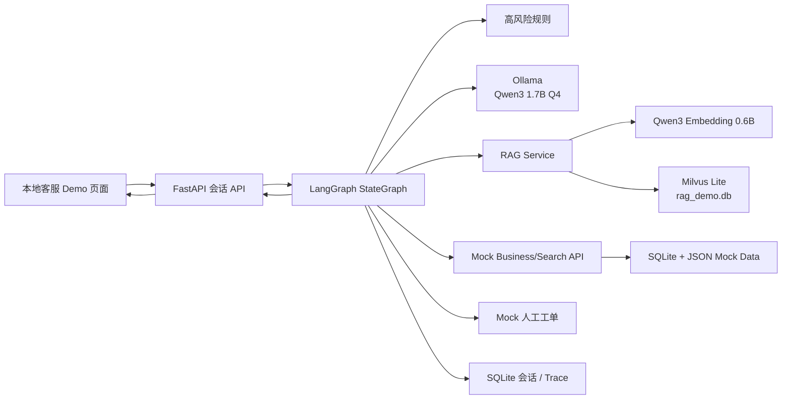
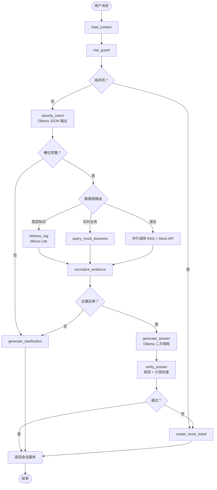

# 汽车后市场智能客服——本地轻量 Demo 方案

> 版本：v0.1  
> 日期：2026-08-09  
> 目标：在单台 Windows 笔记本上验证“会话 → LangGraph 路由 → Mock 业务查询 / RAG → 大模型综合 → 返回前端”的完整链路，不验证生产级容量和高可用。

## 1. 结论与推荐选型

本地 Demo 可行，但应采用 **WSL2 + CPU 推理 + 单并发 + Mock ES/业务服务 + Milvus Lite**。当前检测到本机为 8 个逻辑处理器、NVIDIA GeForce MX350 2GB 显存、可用内存约 4GB，且尚未安装 Ollama、Docker 和可调用的 Python。MX350 显存不足以完整承载推荐模型，因此以 CPU/系统内存推理为主，不把 GPU 加速作为成功前提。

### 1.1 推荐技术栈

| 模块 | 本地 Demo 选型 | 原因 |
|---|---|---|
| 操作环境 | WSL2 Ubuntu 22.04/24.04 | Milvus Lite 官方主要支持 Linux/macOS；避免 Windows 原生兼容问题 |
| Python | Python 3.11 | 兼容 FastAPI、LangGraph、PyMilvus 等依赖 |
| 会话/API | FastAPI + SSE | 轻量，便于同时提供前端接口和 Mock 服务 |
| Demo 前端 | FastAPI 静态 HTML + 原生 JS | 不引入 Node/React 构建链，最低资源占用 |
| 编排 | LangGraph | 保留目标架构；用 StateGraph 实现确定性路由 |
| 聊天模型 | `qwen3:1.7b-q4_K_M`（Ollama） | 约 1.4GB，中文能力、结构化输出和工具调用比 0.6B 更适合 Demo |
| 极限低配模型 | `qwen3:0.6b` | 仅用于验证接口连通；不作为业务质量结论 |
| Embedding | `qwen3-embedding:0.6b`（Ollama） | 约 639MB，支持中文和多语言，适合小规模知识库 |
| 向量库 | Milvus Lite（`pymilvus`） | 单文件、无需 Docker，API 可平滑迁移到 Milvus Standalone/Distributed |
| RAG 检索 | Dense Top-k + 元数据过滤；可选轻量 BM25 融合 | 首版不启用独立 Reranker，降低内存和延迟 |
| Mock ES | FastAPI + SQLite/JSON Repository | 不启动真实 ES JVM；保留受控搜索接口和响应字段 |
| Mock 业务系统 | FastAPI 子路由 | 模拟客户、车辆、商品、价格、订单、营销和人工工单 |
| 会话状态 | SQLite + LangGraph 内存/SQLite Checkpoint | 单机 Demo 足够，重启后可保留必要状态 |
| 测试 | pytest + httpx | 覆盖路由、Mock API、RAG 和端到端用例 |

不推荐首版运行真实 Elasticsearch、Kafka、Debezium、MySQL、Redis和 Milvus Standalone。这些组件会显著增加内存和安装复杂度，对验证 Agent 主流程没有必要。

### 1.2 为什么不选最小的 0.6B 生成模型

`qwen3:0.6b` 可以运行，但在中文意图识别、多轮槽位、JSON 稳定性和多来源证据综合上容易失败。`qwen3:1.7b-q4_K_M` 约 1.4GB，是本机“最小可用”推荐；如果 1.7B 仍频繁输出非法 JSON，可升级到 `qwen3:4b-instruct`，但当前 8GB 级内存机器运行 4B 会明显变慢并增加换页风险。

聊天模型和 Embedding 模型不必同时常驻。导入知识时加载 Embedding；在线问答阶段可以让 Ollama 卸载 Embedding 后加载聊天模型，减少峰值内存。

## 2. Demo 范围

### 2.1 验证内容

- 用户在本地网页发送消息并接收流式或准流式回答。
- 会话服务只负责消息接入、幂等、保存和返回，不做意图识别。
- LangGraph 先执行高风险规则，再调用 Ollama 路由模型输出结构化意图和槽位。
- 通用轮胎知识进入 RAG，使用 `qwen3-embedding:0.6b + Milvus Lite` 检索。
- 商品、价格、订单、营销和用户车辆通过 Mock Search/Business API 查询。
- LangGraph 将检索结果写入 Graph State，再次调用 Ollama 生成最终回答。
- 退款、投诉、安全风险和低置信度问题进入 Mock 人工工单。
- 输出引用、数据时间、路由轨迹和 `trace_id`。

### 2.2 不验证内容

- 模型微调训练；Demo 先预留 Adapter/模型名配置，使用提示词和少量示例验证链路。
- 真实 ES、MySQL CDC、Kafka和跨系统网络。
- 多机、高可用、生产权限、生产隐私合规和大规模并发。
- 自动退款、订单变更、发券或库存修改。

## 3. 本地逻辑架构



物理上首版只有三个进程：Ollama、FastAPI 应用、浏览器。Milvus Lite 与 SQLite 嵌入 FastAPI 进程，不需要 Docker 或独立数据库服务。

## 4. LangGraph 节点



首版不让模型自由选择任意工具。模型只返回 `intent`、`slots`、`missing_slots` 和建议的 `required_tools`，LangGraph 按白名单映射到固定节点。

## 5. Mock 数据方案

### 5.1 数据规模

| 数据域 | 建议条数 | 作用 |
|---|---:|---|
| 用户 | 20 | 登录态、会员等级、地区 |
| 用户车辆 | 30 | 车型年款、前后轮规格 |
| 轮胎 SKU | 80–100 | 品牌、花纹、规格、特性 |
| 地区/门店价格 | 200–300 | 不同地区、渠道、有效期 |
| 库存摘要 | 100–200 | 可售、缺货、门店库存 |
| 订单 | 80–100 | 待付款、已预约、已完成、售后中 |
| 营销活动 | 20–30 | 新客、满减、指定品牌、有效期 |
| RAG 文档 | 30–50 篇 | FAQ、规格解释、保养、修补、安全、售后政策 |
| RAG Chunk | 100–300 | 测试向量检索和引用 |
| 历史问题集 | 100–200 | 路由与端到端回归测试 |

数据必须人为设计“正常、缺字段、过期、冲突、无权限”五类情况，不能全部是顺利路径。

### 5.2 Mock 文件

```text
data/
  customers.json
  vehicles.json
  tire_products.json
  tire_prices.json
  inventory.json
  orders.json
  campaigns.json
  knowledge/
    tire_basics.md
    maintenance.md
    repair_and_safety.md
    warranty_policy_v1.md
  eval/
    routing_cases.jsonl
    rag_cases.jsonl
    e2e_cases.jsonl
```

### 5.3 示例数据

```json
{
  "customer_id": "u_001",
  "name_masked": "张*",
  "region_id": "shanghai",
  "member_level": "gold",
  "vehicle_ids": ["v_001"]
}
```

```json
{
  "vehicle_id": "v_001",
  "customer_id": "u_001",
  "brand": "大众",
  "model": "迈腾",
  "year": 2022,
  "front_tire_spec": "225/55R17",
  "rear_tire_spec": "225/55R17",
  "verified": true
}
```

```json
{
  "sku_id": "sku_001",
  "brand": "示例品牌A",
  "series": "Comfort X1",
  "width_mm": 225,
  "aspect_ratio": 55,
  "rim_inch": 17,
  "load_index": "97",
  "speed_rating": "W",
  "run_flat": false,
  "sale_status": "on_sale",
  "updated_at": "2026-08-09T10:00:00+08:00"
}
```

```json
{
  "order_id": "o_001",
  "customer_id": "u_001",
  "sku_ids": ["sku_001"],
  "status": "appointed",
  "store_id": "store_sh_01",
  "appointment_at": "2026-08-12T14:00:00+08:00",
  "amount": 1598.00,
  "updated_at": "2026-08-09T11:30:00+08:00"
}
```

## 6. Mock API

### 6.1 对前端

- `POST /api/v1/conversations`
- `POST /api/v1/conversations/{id}/messages`
- `GET /api/v1/conversations/{id}/events`：SSE
- `POST /api/v1/conversations/{id}/handoff`
- `POST /api/v1/answers/{id}/feedback`

### 6.2 Mock 客户与车辆

- `GET /mock/customers/{customer_id}`
- `GET /mock/customers/{customer_id}/vehicles`
- `GET /mock/vehicles/{vehicle_id}`

### 6.3 Mock 商品、价格和订单

- `POST /mock/search/products`
- `POST /mock/search/prices`
- `POST /mock/search/campaigns`
- `POST /mock/orders/query`
- `POST /mock/orders/verify-owner`
- `POST /mock/prices/verify`

### 6.4 Mock ES 兼容接口

如果需要演示 ES 调用形态，可增加以下有限接口：

- `POST /mock-es/tire_product_current/_search`
- `POST /mock-es/tire_price_current/_search`
- `POST /mock-es/tire_order_current/_search`
- `POST /mock-es/tire_campaign_current/_search`

只支持 Demo 必需的 `term`、`terms`、`range`、`bool.filter`、`size` 和简单排序。应用代码优先依赖 `SearchRepository` 抽象，而不是把 Mock ES DSL 散落在 LangGraph 节点中：

```python
class SearchRepository(Protocol):
    async def search_products(self, query: ProductQuery) -> list[ProductHit]: ...
    async def search_prices(self, query: PriceQuery) -> list[PriceHit]: ...
    async def search_orders(self, query: OrderQuery) -> list[OrderHit]: ...
```

本地使用 `MockSearchRepository`；后续真实环境替换为 `ElasticsearchRepository`，LangGraph 不需要改图结构。

## 7. Milvus Lite RAG

### 7.1 Collection

Collection：`rag_tire_demo_v001`。

字段：`chunk_pk, document_id, chunk_id, title, doc_type, status, effective_from, effective_to, content, source_uri, embedding_model, embedding_version, embedding`。

Demo 单租户可以省略复杂 ACL，但接口仍保留 `tenant_id=t_demo` 和 `biz_line=tire`，避免以后破坏契约。Milvus Lite 不支持生产版的全部分区/分片能力，不能用 Demo 性能推断生产集群性能。

### 7.2 摄取

1. 读取 Markdown 文档。
2. 按标题切分，再按约 300–500 中文字符切片，重叠 50–80 字。
3. 调用 Ollama `qwen3-embedding:0.6b` 批量生成向量。
4. 写入 Milvus Lite 数据文件。
5. 保存文档版本、来源和生效时间。

### 7.3 检索

首版采用 Dense Top-5，按 `status` 和有效期过滤；再使用简单关键词覆盖率或 RRF 与本地 BM25 合并，最终保留 Top-3 给生成模型。为控制上下文，每个证据片段最多 500 中文字符，总证据不超过约 1500–2000 字。

独立 Reranker 暂不启用，因为会额外占用约数百 MB 到数 GB 内存。冻结集显示召回不足后再增加小型 Reranker。

## 8. 本机资源与性能要求

### 8.1 最低条件

| 资源 | 最低 | 推荐 |
|---|---:|---:|
| CPU | 4 核 / 8 线程 | 8 核以上 |
| 系统内存 | 8GB | 16GB |
| GPU | 无要求 | NVIDIA 6GB+；当前 MX350 2GB 仅可能部分卸载 |
| 可用磁盘 | 12GB | 25GB+ |
| 并发 | 1 | 1–2 |
| 系统 | Windows + WSL2 | WSL2 Ubuntu + SSD |

当前机器满足 CPU 最低条件，GPU 不满足推荐条件，内存处于最低边缘。磁盘命令未能得到可信余量，安装前必须确认 C 盘或 WSL 所在磁盘至少有 12GB，建议预留 25GB。

### 8.2 Demo 性能目标

| 指标 | 本机目标 | 说明 |
|---|---:|---|
| 路由模型 P95 | ≤5 秒 | 关闭深度思考，输出限制 150 token |
| Mock API P95 | ≤100 ms | 纯本地 SQLite/JSON |
| RAG 检索 P95 | ≤1.5 秒 | 不含首次 Embedding 冷启动 |
| 最终回答首 token P95 | ≤8 秒 | CPU 推理，可接受 Demo 级等待 |
| 完整回答 P95 | ≤25 秒 | 回答限制 200–300 中文字 |
| 生成速度 | 约 5–15 token/s 为可接受 | 实际取决于 CPU、内存带宽和温控 |
| 峰值内存 | 尽量 ≤7GB | 避免系统频繁换页 |
| 并发 | 1 | 超出只用于观察排队，不作为验收失败 |
| RAG Recall@5 | ≥80% | 以 30–50 条人工标注问题验证 |
| 意图准确率 | ≥85% | 以 50–100 条路由用例验证 |
| JSON 输出成功率 | ≥95% | 最多允许程序修复/重试一次 |

如果实际只有 8GB 内存，建议：

- Ollama 上下文限制在 2048–4096 token，不使用模型标称最大上下文。
- 设置单并发和最大输出长度；路由调用关闭 thinking。
- Embedding 导入和在线生成分时运行，减少双模型同时常驻。
- 不启动 Docker Desktop、真实 ES、IDE 大型插件或多个浏览器标签。
- 如果出现持续换页或单轮超过 40 秒，退回 `qwen3:0.6b` 仅验证流程，或升级到 16GB 内存/换更强机器进行质量测试。

## 9. 项目目录

```text
local-demo/
  README.md
  pyproject.toml
  .env.example
  app/
    main.py
    config.py
    api/
      conversations.py
      mock_business.py
      mock_es.py
    graph/
      state.py
      workflow.py
      nodes/
        risk_guard.py
        classify_intent.py
        retrieve_rag.py
        query_business.py
        generate_answer.py
        verify_answer.py
        handoff.py
    llm/
      ollama_client.py
      schemas.py
    rag/
      ingest.py
      retriever.py
      milvus_store.py
    repositories/
      interfaces.py
      mock_search.py
      elasticsearch_search.py
    web/
      index.html
      app.js
  data/
  tests/
    test_routing.py
    test_rag.py
    test_mock_apis.py
    test_e2e.py
  scripts/
    seed_mock_data.py
    ingest_knowledge.py
    benchmark.py
```

## 10. 端到端样例

### 10.1 固定知识

用户：“225/55R17 是什么意思？”  
预期：路由到 RAG，Milvus 返回规格解释，大模型结合证据回答并给出引用。

### 10.2 混合查询

用户：“我的迈腾换一套舒适型轮胎多少钱？”  
预期：读取 Mock 车辆 → 查询规格匹配商品 → 查询上海价格 → Mock 校价 → 大模型综合，明确地区、数量和数据时间。

### 10.3 订单查询

用户：“我昨天的订单预约到几点？”  
预期：验证 Mock 用户与订单归属 → 返回预约时间；查询其他用户订单时不泄露是否存在。

### 10.4 高风险

用户：“轮胎鼓包了还能跑高速吗？”  
预期：规则优先输出安全提示，可创建 Mock 人工任务，不由模型自由发挥。

### 10.5 退款

用户：“这个订单我要退款。”  
预期：收集最少必要信息 → 创建 Mock 工单 → 返回 `handoff_id`，不修改订单。

## 11. 实施顺序

1. **环境阶段**：确认磁盘；安装 WSL2、Ubuntu、Python 3.11 和 Ollama。
2. **最小模型阶段**：拉取 `qwen3:1.7b-q4_K_M` 与 `qwen3-embedding:0.6b`，分别完成聊天和 Embedding 健康检查。
3. **Mock 阶段**：生成 JSON/SQLite 数据，实现客户、车辆、商品、价格、订单、营销和人工工单接口。
4. **RAG 阶段**：准备 30–50 篇文档，导入 Milvus Lite，完成引用检索。
5. **LangGraph 阶段**：实现状态、风险、路由、检索、综合、校验和人工节点。
6. **前端阶段**：实现简单聊天页、SSE、引用、trace 和人工提示。
7. **测试阶段**：完成路由、RAG、接口和 20–30 条端到端回归。
8. **性能阶段**：运行单并发 benchmark，记录 CPU、内存、TTFT、完整耗时和错误率。

## 12. 验收标准

- 五类核心场景全部跑通：知识、商品价格、订单、退款、安全风险。
- 会话服务不包含意图分类和答案拼装业务逻辑。
- 一轮普通查询清晰记录两次模型调用：路由和最终生成。
- RAG 回答显示 `document_id/chunk_id/source_uri`。
- 实时回答显示 Mock 数据的 `updated_at`，订单查询执行用户归属校验。
- 模型输出非法 JSON 时最多重试一次，之后降级而不是无限循环。
- 单并发完成回答 P95 不超过 25 秒；若硬件导致未达标，报告实际数据并区分模型推理瓶颈与应用瓶颈。
- 所有自动测试通过，并能通过配置切换 Mock Repository 与未来 ES Repository。

## 13. 后续替换关系

| 本地 Demo | 生产替换 |
|---|---|
| Ollama + Qwen3 1.7B | vLLM + 经过 SFT 的候选大模型 |
| Milvus Lite | Milvus Distributed |
| JSON/SQLite Mock Search | Elasticsearch |
| Mock Business API | 真实客户/车辆/商品/订单/营销 API |
| SQLite Checkpoint | PostgreSQL HA Checkpoint |
| 单进程 FastAPI | K8s 多副本服务 |
| 本地 Trace | 企业日志、指标、链路与 LLM 评测平台 |

只要 Repository、LLM Client、Retrieval Service 和 Graph State 契约不变，以上替换不应改变 LangGraph 主流程。

## 14. 当前阻塞项

- Ollama、Python、WSL2 尚未确认安装。
- Docker 未安装，但本方案不要求 Docker。
- 可用磁盘空间未能可靠读取；安装模型与 WSL2 前必须人工确认。
- 总内存只能从当前可用内存和机器配置侧面判断，建议在任务管理器确认是否为 8GB；若低于 8GB，不建议在本机同时运行完整 Demo。

## 15. 参考资料

- Ollama Qwen3 模型标签与大小：https://ollama.com/library/qwen3/tags
- Ollama Qwen3 Embedding：https://ollama.com/library/qwen3-embedding
- Ollama Tool Calling：https://docs.ollama.com/capabilities/tool-calling
- LangGraph Graph API：https://docs.langchain.com/oss/python/langgraph/use-graph-api
- LangChain Ollama 集成：https://docs.langchain.com/oss/python/integrations/providers/ollama/
- Milvus Lite：https://milvus.io/docs/milvus_lite.md
